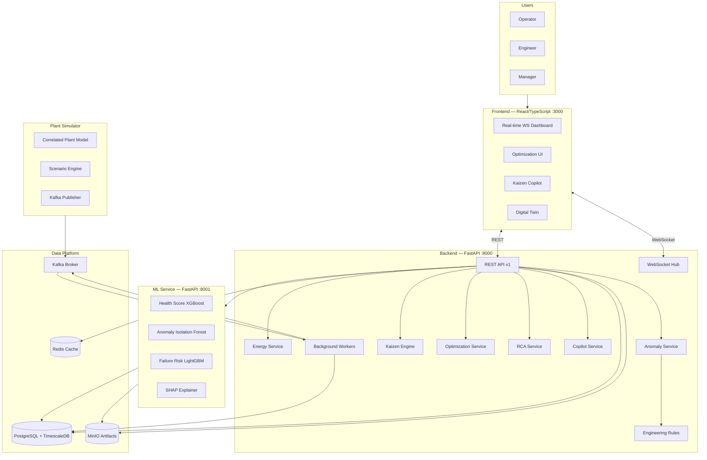

# KAIZEN — Architecture Guide

## System Architecture



## Intelligence Loop

```
OBSERVE (Real-time telemetry, 200+ sensors, 5s intervals)
   ↓
ANALYZE (Engineering rules + Statistical anomaly + ML anomaly)  
   ↓
UNDERSTAND (Root cause correlation, parameter ranking)
   ↓
PREDICT (Health score, failure risk, energy forecast)
   ↓
OPTIMIZE (Constrained optimization: SciPy differential_evolution)
   ↓
RECOMMEND (Ranked opportunities, SHAP-explained)
   ↓
APPROVE (Operator approval workflow, audit trail)
   ↓
ACT (Simulator applies recommended change)
   ↓
VERIFY (Before/after comparison, savings calculation)
   ↓
LEARN (Update model registry, Kaizen closed)
   ↓
KAIZEN (Score improves, next opportunity identified)
```

## Data Flow

```
Plant (simulated)
    ↓ 5s interval
Simulator (correlated noise model)
    ↓ Kafka topic: plant.telemetry
Kafka Consumer (backend worker)
    ↓ batch write
TimescaleDB (sensor_readings hypertable)
    ↓ query
Backend Services
    ├─ Energy Service → SEC, balance
    ├─ Anomaly Service → EWMA + rules + IsolationForest
    ├─ Kaizen Engine → opportunity ranking
    └─ Copilot Service → grounded Q&A
    ↓ REST + WebSocket
Frontend
    ↓ render
Operator
```

## Hybrid AI Architecture

```
Layer 1: Physics / Engineering Rules
  - IF BZT > 1500°C THEN high temperature alarm
  - IF fan_power > baseline*1.15 AND production ≈ const THEN energy inefficiency

Layer 2: Statistical Analytics  
  - EWMA baseline tracking
  - Z-score anomaly detection
  - Correlation analysis (Pearson, rolling)

Layer 3: Machine Learning
  - Isolation Forest: multivariate anomaly detection
  - XGBoost: equipment health regression
  - LightGBM: failure risk classification
  - SHAP: feature importance for every prediction

Layer 4: Constrained Optimization
  - SciPy differential_evolution for global search
  - scipy.optimize.minimize for local refinement
  - Constraints: production ≥ demand, quality in bounds

Layer 5: Generative Explanation (Copilot)
  - Template-based, database-grounded responses
  - No hallucination: queries real sensor data
  - Explicitly labels: ACTUAL / PREDICTED / SIMULATED
```

## Database Architecture

### Hypertables (TimescaleDB)
| Table | Partitioned By | Retention |
|-------|---------------|-----------|
| sensor_readings | time (5-min intervals) | 90 days |
| energy_readings | time (5-min intervals) | 90 days |
| production_records | time (hourly) | 365 days |

### Relational Tables (PostgreSQL)
| Group | Tables |
|-------|--------|
| Plant Hierarchy | plants, areas, departments, equipment, equipment_types, sensors |
| Intelligence | model_registry, predictions, recommendations, kaizen_opportunities |
| Operations | alarms, maintenance_records, audit_logs |
| Users | users, roles |
| Optimization | optimization_runs, simulation_runs, savings_verification |

## API Design

All endpoints under `/api/v1/`. OpenAPI docs at `/docs`.

### Authentication
```
POST /api/v1/auth/login → { access_token, token_type }
GET  /api/v1/auth/me    → { user profile }
```

### Core Endpoints
```
GET  /api/v1/dashboard/overview  → All KPIs for main dashboard
GET  /api/v1/telemetry           → Historical/latest readings
WS   /ws/telemetry               → Real-time stream
GET  /api/v1/energy/sec          → SEC with department breakdown
GET  /api/v1/kaizen              → Ranked opportunities
POST /api/v1/optimization/run    → Constrained optimization
POST /api/v1/simulation/run      → What-if simulation
POST /api/v1/copilot/query       → AI assistant Q&A
POST /api/v1/simulator/scenario  → Change simulation scenario
```

## Security

- JWT tokens (HS256, 8h expiry)
- bcrypt password hashing
- RBAC (6 roles)
- CORS restricted in production
- Input validation via Pydantic
- Audit logging on all mutations
- Secrets via environment variables only (never hardcoded)

## Observability

- Prometheus metrics at `/metrics` (backend + ML service)
- Grafana dashboards (pre-provisioned)
- Structured logging (structlog)
- Health endpoints: `/health`, `/ready`
